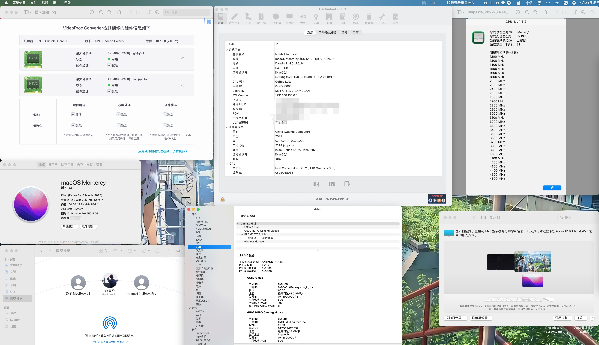
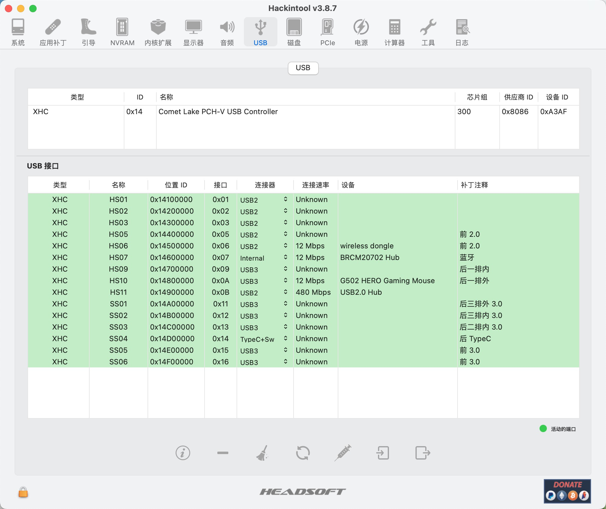
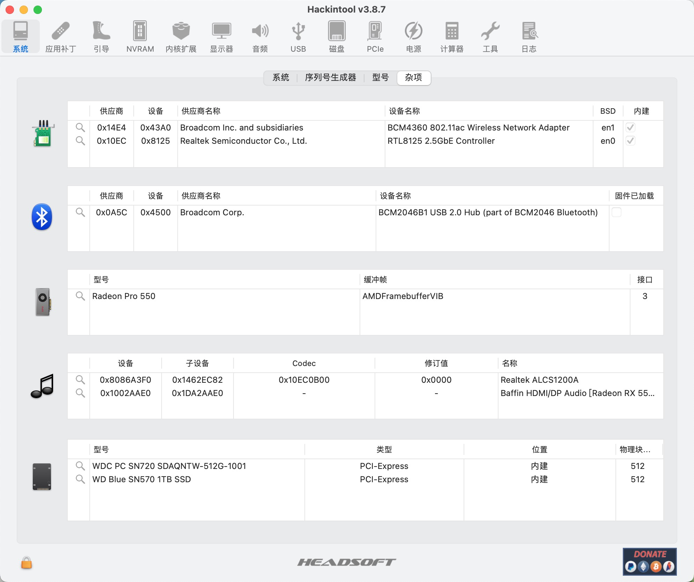
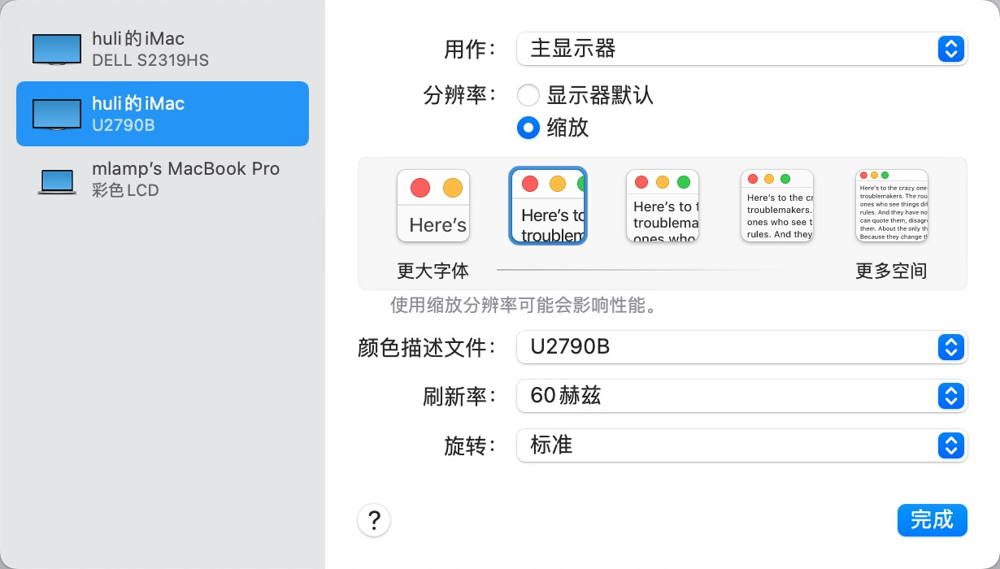

# MSI-B460M-i710700-RX550-Lexa

hackintosh: OpenCore + MSI B460M Mortar + i7 10700 + RX550(Lexa)

长期更新:

-   2022-04-22：升级 macOS 12.3.1 & OC 0.8.0，完美支持，`通用控制`使用正常

-   2022-04-15：安装 macOS 12.2.1 & OC 0.7.8，一切正常

## 硬件配置

| 配置      | 型号                                     |
| --------- | ---------------------------------------- |
| CPU       | i710700 散片                             |
| 主板      | 微星 MSI B460M Mortar 迫击炮 （无 Wifi） |
| 显卡      | 蓝宝石 RX550 4G （Lexa）                 |
| 内存      | 海盗船复仇者 DDR4 3000MHz 16G * 4        |
| SSD       | 西数 SN570 1T + 西数 SN720 512G          |
| 电源      | 酷冷至尊 V550 全模组                     |
| Wifi+蓝牙 | BCM94360CD                               |
| 机箱      | 先马趣造                                 |
| 散热      | 利民AX-120R                              |

## 主机状态说明

Usb 睡眠唤醒，随行，通用控制，隔空投送，4K 60Hz 显示，iCloud 同步，完美支持

## 蓝牙问题说明

白果的蓝牙网卡需要 Usb2.0 的接入，而默认主板上的 Usb2.0 的 9 针接口，不能走 Usb3.0 总线，所以在 Usb 端口定制的时候，不能走内建模式，所以开启 Usb 睡眠唤醒之后，会产生睡眠秒醒的问题。

解决方案：

1.   使用 Usb2.0 转 9 针，接到主板后面的 Usb3.0 端口，Usb 定制选为内建
2.   使用 Usb3.0 的 19 针转 9 针线，接入蓝牙，然后选择内建
3.   使用主板上的 TypeE 接口，购入 TypeE 转 Usb3.0，然后使用 1 中的转 9 针线，接入蓝牙，然后选择内建

我使用第三种方案解决，三种方案都可解决问题，依据个人机箱进行选配。

## 接下来多图告警

